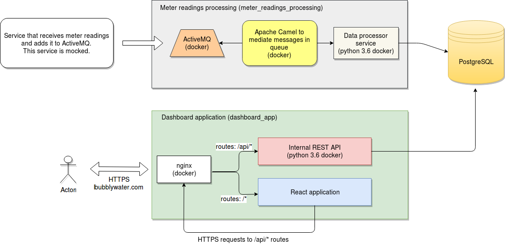

# Bubbly Water Inc.

A small programming exercise. Assignment can be found [here](assignment.pdf).
Test environment can be found [here](http://ec2-35-159-11-120.eu-central-1.compute.amazonaws.com:3333) .

### Assumptions about assignment

- One meter measures only hot or cold water. Not both together.
- Content of meter reading is following:
`{
  "meter_id": "6769f62ffd987be1592fba44b0daab59",
  "type": "HOT|COLD",
  "measured_at": 1523952169,  # Unix Epoc time
  "value": 200,
  "battery": 49  # percentage
}`
- No load tests (keeping it out of scope this time)
- Dashboard interface:
    - No registration or authentication, forgot password, profile edit or new user creation
    - Total daily consumption for all meters
    - Dashboard for single customers:
    - Daily consumptions for single customer
    - Current battery info for meters on customer view
- If there's some kind of disturbance when adding new readings (say power disconnect) then that's not handled in the solution.

### Time limitations, scope

Without any limitations the assignment's scope can grow quite large. I reduced the size of the scope by these limitations:

- Main focus for the application was the front end application and the REST API it uses. I didn't build mock data generator, but
I do give an architecture picture how I would solve such assignment. 
- There is no production build. Only development configuration.
- I decided to build the REST API in Python 3. I'm familiar with Python.
- The frontend is written in React + Redux. I'm new to React so there was a steep learning curve. There's probably a lot in the 
React side that should be done differently. Requires some learning.
- REST API has integration tests (mostly)
- ReactJS has no tests. I'm not familiar with React and creating tests would've tripled the learning time.
- No application logging (didn't have time)
- Poor error handling (didn't have time)

### Architecture

Architecture consist of 2 parts:
- Meter readings processing (not developed).
The idea behind it was that the external service sends a message into ActiveMQ queue. The message consists meter reading data (see above). 
Apache Camel mediates messages and tells micro-services that there's a new message and how to process it. Small service (stateless, easily scalable)
inserts the data into PostgreSQL
- Dashboard application (developed).
Nginx is in front to add scalability. REST API is a stateless Python 3 application running on Flask framework. 
ReactApp is handling frontend logic. 

## Steps to run the application in development

The application is 100% built on docker containers. Dev/test/staging and live environments are all run in docker containers.
This will make development environment setups easy and team can be sure that all developers run with the same environment.

**To run the project in development**

**1. Clone the project**
`git clone git@github.com:MarkoSulamagi/BubblyWaterInc.git`

**2. Install docker**
This is the environment specific part. Installing docker on Linux OSs is usually quite easy. 
I've noticed some installation issues with the Windows and Mac environments, but nothing that quick googling can't fix. 

https://docs.docker.com/install/

On Ubuntu 16.04 https://www.digitalocean.com/community/tutorials/how-to-install-and-use-docker-on-ubuntu-16-04

**3. Install docker-compose**
https://docs.docker.com/compose/

On Ubuntu 16.04 https://www.digitalocean.com/community/tutorials/how-to-install-docker-compose-on-ubuntu-16-04

**4. Build application**

`docker-compose build`

Docker needs to download all the dependencies, so it could take a while.

**5. Run application**

`docker-compose up`

Docker needs to download all the dependencies, so it could take a while. 
Depending on the speed of the internet. Downloads only happen on first run. 

**6. Run DB migrations**

`docker exec -it bubblywater_api python manage.py db init`

`docker exec -it bubblywater_api python manage.py db migrate`

`docker exec -it bubblywater_api python manage.py db upgrade`

**7.Seed database**

`docker exec -it bubblywater_api python manage.py seed`

**8. Visit http://localhost:3333**

## Some development helpers. Only useful for additional development 

**Run API integration tests**

`docker exec -it bubblywater_api python -m unittest tests`

**Purge database**

`docker exec -it bubblywater_api python manage.py purge`

**Install new JS library**

`docker exec -it bubblywater_reactapp npm install --save redux`

